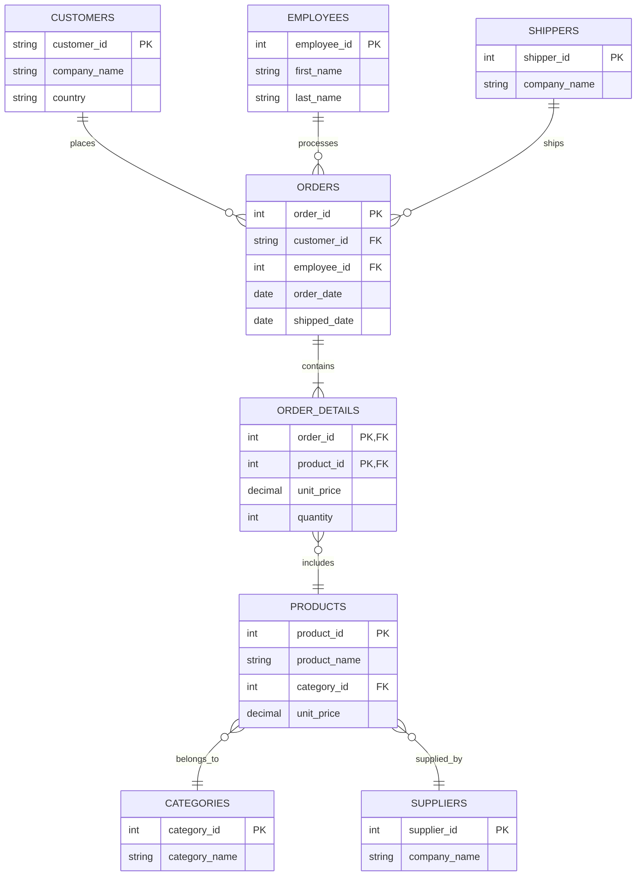

## 🎨 **I Didn't Create an ER.png - But Here's How YOU Can**

Good catch! I referenced an ER diagram in the README template but didn't actually provide one. Let me show you **exactly how to create one** for your Northwind database.

---

## 🛠️ **Best Tools for Creating Database ER Diagrams**

### **Option 1: DbDiagram.io (RECOMMENDED - Easiest)**

**Why this is best:**
- ✅ Free
- ✅ Web-based (no installation)
- ✅ Professional output
- ✅ Export as PNG/PDF/SVG
- ✅ Simple syntax
- ✅ Can save and edit later

**Steps:**

1. **Go to:** https://dbdiagram.io
2. **Click "Go to App"**
3. **Paste this code** into the editor:

```sql
// Northwind Database Schema

Table customers {
  customer_id varchar [pk]
  company_name varchar
  contact_name varchar
  country varchar
}

Table orders {
  order_id int [pk]
  customer_id varchar [ref: > customers.customer_id]
  employee_id int [ref: > employees.employee_id]
  order_date date
  required_date date
  shipped_date date
  ship_via int [ref: > shippers.shipper_id]
  freight decimal
  ship_country varchar
}

Table order_details {
  order_id int [pk, ref: > orders.order_id]
  product_id int [pk, ref: > products.product_id]
  unit_price decimal
  quantity int
  discount decimal
}

Table products {
  product_id int [pk]
  product_name varchar
  category_id int [ref: > categories.category_id]
  supplier_id int [ref: > suppliers.supplier_id]
  unit_price decimal
  units_in_stock int
  discontinued boolean
}

Table categories {
  category_id int [pk]
  category_name varchar
  description text
}

Table employees {
  employee_id int [pk]
  first_name varchar
  last_name varchar
  title varchar
  city varchar
}

Table suppliers {
  supplier_id int [pk]
  company_name varchar
  country varchar
}

Table shippers {
  shipper_id int [pk]
  company_name varchar
}
```

4. **The diagram appears automatically on the right!**
5. **Export:** Click "Export" → PNG (or SVG for high quality)
6. **Download:** Save as `northwind_schema.png`
7. **Move to your project:**
   ```bash
   mv ~/Downloads/northwind_schema.png /Users/b/data/projects/sql-business-intelligence/docs/
   ```

**Result:** Professional ER diagram in 2 minutes! ✅

---

### **Option 2: pgAdmin (Built-in to PostgreSQL)**

**If you already have pgAdmin installed:**

**Steps:**

1. **Open pgAdmin**
2. **Connect to your database** (northwind)
3. **Right-click on the database** → "ERD For Database"
4. **Wait for diagram to generate** (automatic)
5. **Edit layout if needed** (drag tables around)
6. **Export:** Image → Save as PNG
7. **Save as:** `northwind_erd.png`

**Pros:**
- ✅ Already installed
- ✅ Auto-generates from actual database
- ✅ 100% accurate to your schema

**Cons:**
- ⚠️ Can look cluttered
- ⚠️ Less customizable than DbDiagram
- ⚠️ Layout might need manual adjustment

---

### **Option 3: DBeaver (Free Database Tool)**

**If you want a professional database IDE:**

**Download:** https://dbeaver.io/download/

**Steps:**

1. **Install DBeaver Community Edition** (free)
2. **Connect to PostgreSQL:**
   - Database → New Database Connection → PostgreSQL
   - Host: localhost, Port: 5432, Database: northwind
   - Username: postgres, Password: [your password]
3. **Open ER Diagram:**
   - Right-click database → "View Diagram"
   - OR: Select multiple tables → Right-click → "View Diagram"
4. **Customize:**
   - Drag tables to arrange nicely
   - Show/hide columns
   - Adjust connector lines
5. **Export:** File → Export → Image (PNG/SVG)

**Pros:**
- ✅ Professional tool (good to learn anyway)
- ✅ Excellent diagram customization
- ✅ Can use for other database tasks

**Cons:**
- ⚠️ Requires installation
- ⚠️ Learning curve

---

### **Option 4: Draw.io / Diagrams.net (Manual but Flexible)**

**For complete control:**

**Go to:** https://app.diagrams.net/

**Steps:**

1. **Click "Create New Diagram"**
2. **Choose "Blank Diagram"**
3. **Use shapes to create:**
   - Rectangles for tables
   - Lines for relationships
   - Text for field names
4. **Manually build your schema**
5. **Export:** File → Export As → PNG

**Pros:**
- ✅ Total customization
- ✅ Beautiful output
- ✅ Can add annotations, colors, etc.

**Cons:**
- ❌ Manual work (tedious for large schemas)
- ❌ Time-consuming

---

### **Option 5: Mermaid (Code-Based, GitHub Native)**

**For embedding directly in GitHub README:**

**Add this to your README.md:**

````markdown
## Database Schema


````

**GitHub automatically renders this as a diagram!**

**Pros:**
- ✅ No separate image file needed
- ✅ Version controlled (it's just text)
- ✅ Renders natively in GitHub
- ✅ Easy to update

**Cons:**
- ⚠️ Less customizable
- ⚠️ Only works on GitHub/GitLab

---

## 🎯 **My Recommendation for YOU**

### **Use DbDiagram.io**

**Why:**
1. ✅ **2 minutes to create** (fastest)
2. ✅ **Professional output** (looks great)
3. ✅ **No installation** (web-based)
4. ✅ **Easy to edit** (save and modify later)
5. ✅ **Free** (no cost)

**Your workflow:**

```bash
# 1. Go to dbdiagram.io
# 2. Paste the Northwind schema code I gave you above
# 3. Export as PNG
# 4. Download to your project

cd /Users/b/data/projects/sql-business-intelligence
mkdir -p docs
mv ~/Downloads/northwind_schema.png docs/

# 5. Reference in README:
# 

# 6. Commit
git add docs/northwind_schema.png
git commit -m "Add database ER diagram"
git push
```

**Done in 5 minutes!** ✅

---

## 📸 **What Your ER Diagram Should Show**

### **Essential Elements:**

✅ **All tables** (customers, orders, products, etc.)  
✅ **Primary keys** (PK indicator)  
✅ **Foreign keys** (FK indicator)  
✅ **Relationships** (lines connecting tables)  
✅ **Cardinality** (1-to-many, many-to-many symbols)  

### **Optional but Nice:**

⭐ **Key columns** (not every column, just important ones)  
⭐ **Data types** (varchar, int, decimal)  
⭐ **Table descriptions**  

### **Don't Overdo It:**

❌ Don't show EVERY column (too cluttered)  
❌ Don't make it tiny (needs to be readable)  
❌ Don't use weird colors (keep it professional)  

---

## 📝 **Where to Use Your ER Diagram**

### **1. In Your README:**

```markdown
## Database Schema

The Northwind database follows this schema:


**Key Relationships:**
- Customers place multiple Orders (1:N)
- Orders contain multiple OrderDetails (1:N)
- Products belong to Categories (N:1)
- Employees process Orders (1:N)
```

### **2. In a Separate Documentation File:**

Create `docs/database_schema.md`:

```markdown
# Northwind Database Schema

## Entity Relationship Diagram


## Table Descriptions

### customers
Stores customer information including company name and location.

**Key Fields:**
- `customer_id` (PK) - Unique customer identifier
- `company_name` - Customer company name
- `country` - Customer location

### orders
Tracks customer orders with dates and shipping info.

[etc...]
```

### **3. In Your Portfolio Website:**

If you create a portfolio site, include the diagram on your project page.

---

## 🚀 **Quick Start: Create Your Diagram NOW**

**Do this right now (5 minutes):**

1. **Open:** https://dbdiagram.io
2. **Click:** "Go to App"
3. **Copy/paste** the Northwind schema code I provided above
4. **Click:** Export → PNG
5. **Save as:** `northwind_schema.png`
6. **Move to your project:**
   ```bash
   mkdir -p /Users/b/data/projects/sql-business-intelligence/docs
   mv ~/Downloads/northwind_schema.png /Users/b/data/projects/sql-business-intelligence/docs/
   ```
7. **Add to README:**
   ```markdown
   ## Database Schema
   
   
   ```
8. **Commit:**
   ```bash
   git add docs/northwind_schema.png
   git add README.md
   git commit -m "Add database ER diagram"
   git push
   ```

**Done! Your project now has a professional schema diagram.** ✅

---

## 🎨 **Bonus: Make It Look REALLY Professional**

### **DbDiagram.io Pro Tips:**

**Color coding tables by type:**
```sql
Table customers [headercolor: #3498db] {
  // Customer table in blue
}

Table orders [headercolor: #e74c3c] {
  // Orders table in red
}

Table products [headercolor: #2ecc71] {
  // Products table in green
}
```

**Add notes:**
```sql
Table customers {
  customer_id varchar [pk, note: 'Unique 5-character code']
  company_name varchar [note: 'Official business name']
}
```

**Group related tables:**
```sql
TableGroup Customer_Management {
  customers
  orders
  order_details
}

TableGroup Product_Catalog {
  products
  categories
  suppliers
}
```

---

## ✅ **Final Answer**

**Best tool:** DbDiagram.io (https://dbdiagram.io)

**Why:** Fast, free, professional, no installation

**Your next step:** Spend 5 minutes creating your ER diagram right now using the code I provided.

**Then:** Add it to your project and push to GitHub.

**You'll have a complete, professional SQL project with schema documentation.** 🎨✅